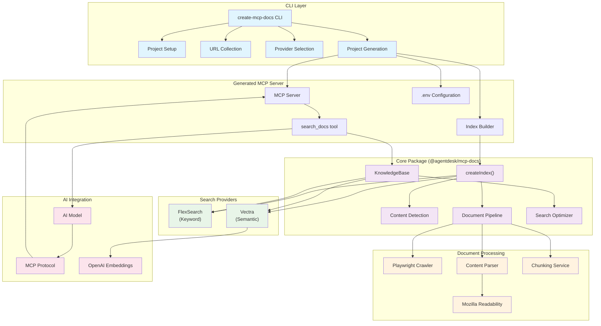
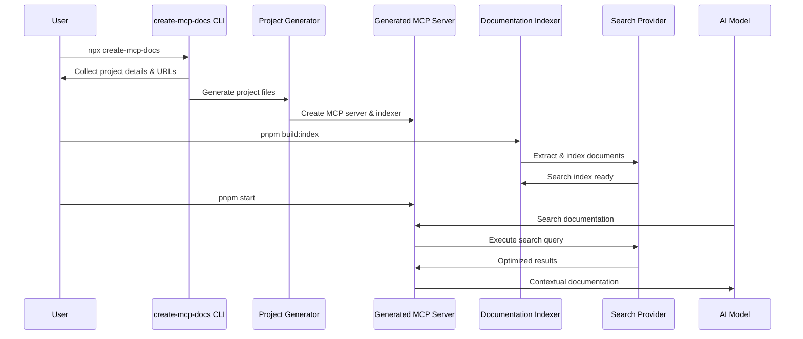

# AgentDesk MCP Documentation System

🚀 **Modern toolkit for creating Model Context Protocol (MCP) documentation servers with intelligent content detection, advanced search optimization, and beautiful CLI tools.**

This repository provides a complete system for building MCP documentation servers that can intelligently crawl, index, and search documentation websites with both keyword and semantic search capabilities.

## 📦 Packages

### Core Packages

- **[`@agentdesk/mcp-docs`](./packages/mcp-docs)** - Core documentation indexing and search functionality
- **[`create-mcp-docs`](./packages/create-mcp-docs)** - CLI tool for generating MCP documentation servers

## 🚀 Quick Start

### Create a New MCP Documentation Server

```bash
npx create-mcp-docs my-docs-server
```

This interactive CLI will:

1. ✨ Guide you through project setup (name and description)
2. 🌐 Collect documentation URLs to crawl
3. ⚙️ Let you choose between FlexSearch (keyword) or Vectra (semantic) search
4. 📁 Generate a complete MCP server project
5. ✅ Provide ready-to-use TypeScript code

### Generated Project Structure

```
packages/my-docs-server/
├── package.json          # Dependencies and scripts
├── src/
│   ├── server.ts         # MCP server implementation
│   └── build-index.ts    # Documentation indexer
├── .env                  # Environment configuration
├── README.md            # Usage instructions
└── ...
```

### Start Your Server

```bash
cd packages/my-docs-server
pnpm install
pnpm build:index    # Build documentation search index
pnpm start          # Start MCP server
```

## ⚡ Search Provider Comparison

Choose the right search provider for your needs:

### 🔍 FlexSearch (Keyword Search)

**Best for**: Smaller documentation sets, fast setup, exact term matching

**Pros**:

- Lightning-fast search performance
- No API keys required
- Smaller index size
- Great for technical documentation with specific terms

**Cons**:

- Limited semantic understanding
- May miss conceptually related content

### 🧠 Vectra (Semantic Search)

**Best for**: Large documentation sets, conceptual queries, content discovery

**Pros**:

- Understands meaning and context
- Finds conceptually related content
- Better for natural language queries
- Advanced "Late Chunking" for context preservation

**Cons**:

- Requires OpenAI API key
- Larger index size
- Slightly slower initial indexing

## 🏗️ System Architecture

### Complete System Overview



### User Workflow



## ✨ Key Features

### 🧠 **Intelligent Content Detection**

- Automatically detects optimal CSS selectors using heuristics
- Integrates Mozilla Readability for content extraction
- Provides confidence scoring and fallback options
- Validates selectors against real page content

### 🎨 **Beautiful CLI Experience**

Interactive React-based CLI with:

- **Project Setup**: Name and description input
- **URL Collection**: Add multiple documentation sources
- **Provider Selection**: Choose between FlexSearch and Vectra
- **Live Generation**: Real-time project creation feedback
- **Success Guide**: Clear next steps after creation

### 🚀 **Document-Centric Search Optimization**

Advanced search optimization that goes beyond simple keyword matching:

- **Full Document Strategy**: Returns entire documents when multiple chunks are highly relevant
- **Expanded Chunk Strategy**: Intelligently expands related content sections
- **Token Budget Management**: Optimizes results to fit within AI model context limits
- **Coherence Preservation**: Maintains document structure and context flow

### ⚡ **High Performance Indexing**

- **Intelligent Crawling**: Playwright-powered browser automation
- **Content Cleaning**: Mozilla Readability integration for clean extraction
- **Flexible Chunking**: Traditional, semantic, and Late Chunking strategies
- **Concurrent Processing**: Configurable concurrency with rate limiting

### 🔧 **Production-Ready Servers**

- Follows established MCP server patterns
- Built with TypeScript for full type safety
- Comprehensive error handling and logging
- Environment-based configuration
- Ready for deployment with zero additional setup

## 🎯 Use Cases

### Documentation Teams

```bash
# Create a server for your product docs
npx create-mcp-docs product-docs
# URLs: https://docs.yourproduct.com
# Choose FlexSearch for fast, precise searches
```

### Large Knowledge Bases

```bash
# Create a semantic search server for comprehensive docs
npx create-mcp-docs comprehensive-docs
# URLs: Multiple documentation sources
# Choose Vectra for conceptual understanding
```

### API Documentation

```bash
# Create a server for API reference
npx create-mcp-docs api-docs
# URLs: https://api.yourservice.com/docs
# FlexSearch excels at exact API method/parameter searches
```

## 🔬 Advanced Features

### Late Chunking Strategy

For Vectra users, our "Late Chunking" implementation preserves contextual information across chunk boundaries:

- **Contextual Embeddings**: Documents are processed through full context before chunking
- **Semantic Boundaries**: Intelligent splitting that respects document structure
- **Context Preservation**: Related information stays connected across chunks
- **Optimized for Documentation**: Tuned specifically for technical documentation patterns

_Learn more in the [`@agentdesk/mcp-docs` documentation](./packages/mcp-docs/README.md#late-chunking-implementation)_

### Document-Centric Optimization

Our search optimizer analyzes raw search results and intelligently decides the best strategy:

```typescript
// Example optimization strategies
{
  fullDocumentThreshold: 3,      // 3+ chunks = return full document
  expandedChunkMultiplier: 2,    // Expand single chunks by 2x
  targetUtilization: 0.9,        // Use 90% of token budget
}
```

_Detailed algorithm explanations in the [core package documentation](./packages/mcp-docs/README.md#search--optimization-strategies)_

## 🔧 Advanced Configuration

### Manual Index Creation

```typescript
import { createIndex } from "@agentdesk/mcp-docs";

await createIndex({
  pages: [
    {
      url: "https://docs.example.com",
      mode: "crawl",
      selectors: {
        links: 'a[href^="/docs"]',
        content: "article.prose",
      },
    },
  ],
  // Choose your provider
  provider: {
    type: "vectra",
    embeddings: {
      provider: "openai",
      model: "text-embedding-ada-002",
      apiKey: process.env.OPENAI_API_KEY,
    },
    chunking: {
      strategy: "late-chunking",
      useCase: "documentation",
    },
  },
  outputFile: "docs-vectra-index",
});
```

### Knowledge Base Search

```typescript
import { KnowledgeBase, getModuleDir } from "@agentdesk/mcp-docs";

const docs = new KnowledgeBase({
  path: getModuleDir(import.meta.url), // Directory containing index
  apiKey: process.env.OPENAI_API_KEY, // For Vectra indices
});

const results = await docs.search({
  query: "How do I authenticate users?",
  tokenLimit: 10000,
});
```

## 📚 Documentation

### Package Documentation

- [**@agentdesk/mcp-docs**](./packages/mcp-docs/README.md) - Detailed API reference and algorithms
- [**create-mcp-docs**](./packages/create-mcp-docs/README.md) - CLI tool implementation details

## 🛠️ Development

### Setup

```bash
git clone https://github.com/agentdesk/create-mcp-docs
cd create-mcp-docs
pnpm install
pnpm build
```

### Package Development

```bash
# Core package
cd packages/mcp-docs
pnpm dev

# CLI package
cd packages/create-mcp-docs
pnpm build
pnpm link --global
create-mcp-docs test-project
```

### Testing

```bash
# Run all tests
pnpm test

# Package-specific tests
cd packages/mcp-docs && pnpm test
cd packages/create-mcp-docs && pnpm test
```

## 🏷️ Requirements

- **Node.js** >= 16.0.0
- **pnpm** >= 8.0.0 (recommended)
- **OpenAI API Key** (for Vectra semantic search only)

## 🤝 Contributing

We welcome contributions! Please see:

1. **Issues** - Bug reports and feature requests
2. **Pull Requests** - Code contributions
3. **Documentation** - Improvements and examples

### Development Guidelines

- Use TypeScript for all new code
- Follow existing code style and patterns
- Add comprehensive tests for new features
- Update documentation for API changes

## 📝 License

MIT - See [LICENSE](./LICENSE) file for details.

## 🔗 Related Projects

- [**Model Context Protocol**](https://modelcontextprotocol.io/) - The standard this implements
- [**AgentKit**](https://github.com/BCG-X-Official/agentkit) - AI agent development framework
- [**AgentDesk**](https://www.agentdesk.ai/) - AI agent platform

---

**Built with ❤️ by the AgentDesk team**
