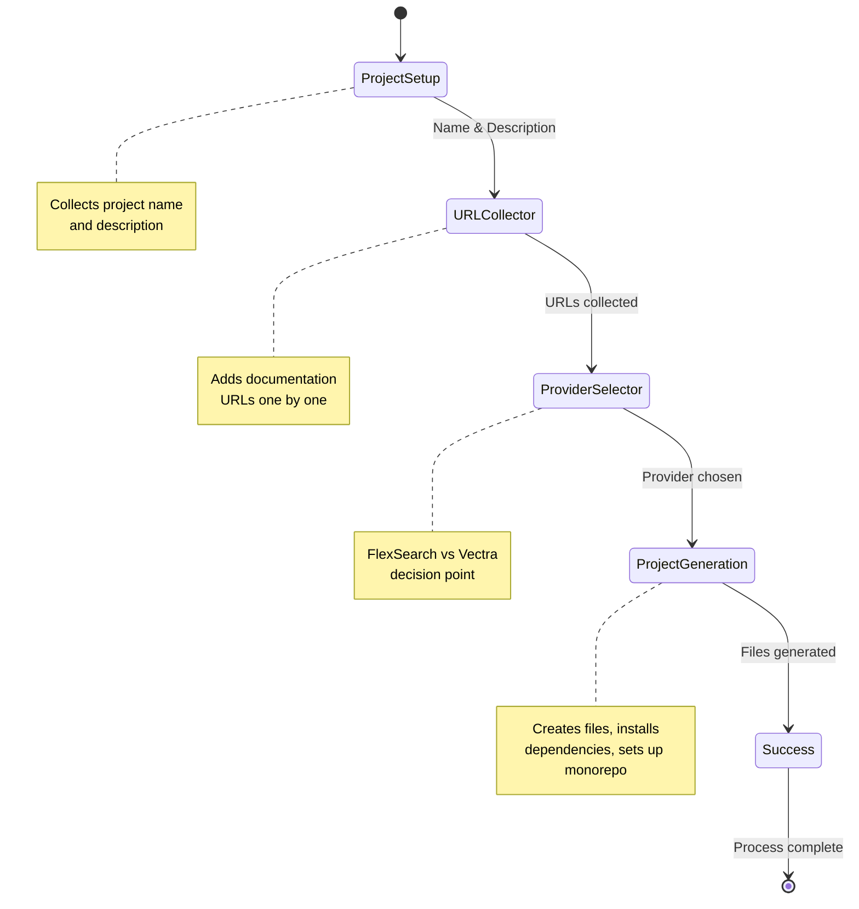

# create-mcp-docs

🚀 CLI tool to create Model Context Protocol (MCP) documentation servers with intelligent content detection, provider selection, and beautiful interactive setup.

## ✨ Features

- **Interactive React CLI** - Beautiful terminal interface built with Ink
- **Provider Selection** - Choose between FlexSearch (keyword) and Vectra (semantic) search
- **Smart Template Generation** - Generates production-ready MCP servers with all dependencies
- **Monorepo Support** - Creates or integrates with existing pnpm workspaces
- **Environment Configuration** - Automatic .env setup for API keys and provider selection
- **Zero Configuration** - Works out of the box with sensible defaults

## 📦 Installation

### Global Installation (Recommended)

```bash
npm install -g create-mcp-docs
```

### One-time Use with npx

```bash
npx create-mcp-docs
```

## 🚀 Quick Start

### Interactive Mode

```bash
create-mcp-docs
```

### With Project Name

```bash
create-mcp-docs my-docs-server
```

### Specify Directory

```bash
create-mcp-docs my-docs-server --directory ./my-workspace
```

## 🎯 CLI Workflow

The interactive CLI guides you through a structured 5-step process:

### Step 1: Project Setup

- **Input**: Project name and optional description
- **Component**: `ProjectSetup`
- **What happens**: Collects basic project metadata

### Step 2: URL Collection

- **Input**: Documentation URLs to index
- **Component**: `URLCollector`
- **What happens**: Builds list of documentation sources to crawl

### Step 3: Provider Selection

- **Input**: Choose FlexSearch or Vectra
- **Component**: `ProviderSelector`
- **What happens**: Selects search provider based on your needs

### Step 4: Project Generation

- **Component**: `ProjectGeneration`
- **What happens**:
  - Creates project directory structure
  - Generates all template files
  - Runs `pnpm install`
  - Sets up monorepo if needed

### Step 5: Success & Next Steps

- **Component**: `Success`
- **What happens**: Shows completion status and next steps

### CLI Flow Diagram



## 📁 Generated Project Structure

```
packages/my-docs-server/
├── package.json                    # Complete dependencies and scripts
├── tsconfig.json                   # TypeScript configuration
├── .env                           # Environment variables (USE_VECTRA, OPENAI_API_KEY)
├── src/
│   ├── server.ts                  # MCP server implementation with KnowledgeBase
│   └── build-index.ts             # Documentation indexing script
├── README.md                      # Comprehensive usage instructions
├── .gitignore                     # Sensible defaults including .env
└── automation-examples/           # GitHub Actions automation templates
    ├── github-workflows/
    │   └── auto-publish.yml       # Auto-publish workflow
    ├── docs-repo-trigger.yml      # Documentation repo trigger
    └── SETUP.md                   # Automation setup instructions
```

## 🔧 Generated MCP Server Deep Dive

The CLI creates a production-ready MCP server with sophisticated features:

### Server Implementation (src/server.ts)

```typescript
import { McpServer } from "@modelcontextprotocol/sdk/server/mcp.js";
import { KnowledgeBase, getModuleDir, getConfig } from "@agentdesk/mcp-docs";

// Automatic API key detection from command line
const { apiKey } = getConfig(process.argv);

const server = new McpServer({
  name: "my-docs-server",
  version: "0.1.0",
});

// Initialize with environment-aware configuration
const docs = new KnowledgeBase({
  path: getModuleDir(import.meta.url),
  apiKey, // Required for Vectra indices
});

// Register search tool with proper schema
server.registerTool(
  "search_my_docs_server_docs",
  {
    title: "Search My Documentation",
    description:
      "Search through documentation with document-centric optimization",
    inputSchema: {
      query: z.string().describe("Natural language query"),
    },
  },
  async ({ query }) => {
    const text = await docs.search({ query, tokenLimit: 10000 });
    return { content: [{ type: "text", text }] };
  }
);
```

### Index Builder (src/build-index.ts)

The generated indexer supports both providers with intelligent configuration:

```typescript
import {
  createIndex,
  type IndexerConfig,
  type EnhancedIndexerConfig,
} from "@agentdesk/mcp-docs";

// Environment-based provider selection
const USE_VECTRA =
  process.env.USE_VECTRA === "true" && process.env.OPENAI_API_KEY;

const baseConfig = {
  pages: [{ url: "https://docs.example.com", mode: "crawl" as const }],
  content: {
    excludePatterns: ["/admin", "/_next", "/changelog"],
  },
  crawler: {
    maxRequestsPerCrawl: 200,
    maxConcurrency: 8,
    retryOnBlocked: true,
  },
  outputFile: path.join(__dirname, "docs-index.json"),
};

// Conditional Vectra configuration
const config = USE_VECTRA
  ? {
      ...baseConfig,
      provider: {
        type: "vectra",
        embeddings: {
          provider: "openai",
          model: "text-embedding-ada-002",
          apiKey: process.env.OPENAI_API_KEY,
        },
        chunking: {
          strategy: "late-chunking",
          useCase: "documentation",
          chunkSize: 1024,
          chunkOverlap: 128,
        },
      },
      outputFile: path.join(__dirname, "docs-vectra-index"),
    }
  : baseConfig;
```

## 📋 Available Scripts (Generated Project)

### Complete Build Pipeline

```bash
pnpm build              # Build index + TypeScript
pnpm build:index        # Build documentation index only
pnpm build:server       # Build TypeScript only
pnpm dev               # TypeScript watch mode
pnpm start             # Start MCP server
pnpm test              # Run tests
```

### Environment Variables

The generated `.env` file controls provider behavior:

```env
USE_VECTRA=true                    # Enable Vectra semantic search
OPENAI_API_KEY=your_api_key_here   # Required for Vectra
```

## 🎨 CLI Implementation Details

### React Component Architecture

The CLI is built with React and Ink for a rich terminal experience:

```typescript
// Main CLI component orchestrates the flow
export function CLI({ projectName, directory }: CLIProps) {
  const [step, setStep] = useState<Step>("projectSetup");
  const [config, setConfig] = useState<ProjectConfig>({});

  // Step progression with state management
  return (
    <Box flexDirection="column">
      {step === "projectSetup" && (
        <ProjectSetup onSubmit={handleProjectSetup} />
      )}
      {step === "urlCollector" && (
        <URLCollector onSubmit={handleUrlCollection} />
      )}
      {step === "providerSelector" && (
        <ProviderSelector onSelect={handleProviderSelect} />
      )}
      {step === "generating" && (
        <ProjectGeneration config={config} onComplete={handleComplete} />
      )}
      {step === "success" && <Success projectName={config.name} />}
    </Box>
  );
}
```

### Component Details

#### ProjectSetup Component

- **Purpose**: Collects project name and description
- **UX**: Sequential input fields with focus management
- **Validation**: Ensures valid project names for npm/filesystem

#### URLCollector Component

- **Purpose**: Builds list of documentation URLs
- **UX**: Dynamic list with add/remove capabilities
- **Features**: URL validation and duplicate detection

#### ProviderSelector Component

- **Purpose**: Choose between FlexSearch and Vectra
- **UX**: Clear comparison of features and trade-offs
- **Logic**: Validates Vectra selection against API key requirements

#### ProjectGeneration Component

- **Purpose**: Creates project files and installs dependencies
- **Process**:
  1. Create directory structure
  2. Generate template files
  3. Handle monorepo integration
  4. Run `pnpm install`
  5. Provide status feedback

#### Success Component

- **Purpose**: Show completion and next steps
- **Content**: Clear instructions for getting started

### Template System

The template system generates customized files based on user input:

```typescript
export interface TemplateConfig {
  projectName: string;
  description?: string;
  urls: string[];
  providerType?: "vectra" | "flexsearch";
  isLocalDevelopment?: boolean;
}

export function getProjectTemplate(config: TemplateConfig): ProjectTemplate {
  return {
    name: config.projectName,
    files: {
      "package.json": generatePackageJson(config),
      "tsconfig.json": generateTsConfig(),
      ".env": generateEnvFile(),
      "src/server.ts": generateServerFile(config),
      "src/build-index.ts": generateBuildIndexFile(config),
      "README.md": generateReadme(config),
      ".gitignore": generateGitignore(),
      // ... automation examples
    },
    rootFiles: {
      // Monorepo files if needed
      "package.json": generateRootPackageJson(),
      "pnpm-workspace.yaml": generateWorkspaceFile(),
      "README.md": generateRootReadme(),
      ".gitignore": generateRootGitignore(),
    },
  };
}
```

## 🏗️ Monorepo Integration

### New Monorepo Creation

When run in an empty directory:

```
my-workspace/
├── package.json                   # Root package.json with scripts
├── pnpm-workspace.yaml           # Workspace configuration
├── README.md                     # Monorepo overview
├── .gitignore                    # Root-level ignores
└── packages/
    └── my-docs-server/           # Generated MCP server
        ├── package.json
        ├── src/
        └── ...
```

### Existing Monorepo Integration

When run in directory with existing `packages/`:

```
existing-workspace/
├── pnpm-workspace.yaml           # Already exists
├── package.json                  # Already exists
└── packages/
    ├── existing-package/         # Existing packages preserved
    └── my-docs-server/           # ← New MCP server added
        └── ...
```

### Workspace Detection Algorithm

```typescript
function isInWorkspace(): boolean {
  const currentDir = path.dirname(fileURLToPath(import.meta.url));

  // Walk up directory tree looking for pnpm-workspace.yaml
  let dir = currentDir;
  for (let i = 0; i < 10; i++) {
    try {
      const workspaceFile = path.join(dir, "pnpm-workspace.yaml");
      if (readFileSync(workspaceFile, "utf-8").includes("packages/*")) {
        return true;
      }
    } catch {
      // Continue searching parent directories
    }
    const parentDir = path.dirname(dir);
    if (parentDir === dir) break; // Reached filesystem root
    dir = parentDir;
  }
  return false;
}
```

## 🎨 CLI Options

### Commands

```bash
create-mcp-docs [project-name] [options]
```

### Options

- `--directory, -d <dir>` - Target directory (default: current directory)
- `--help, -h` - Show help information
- `--version, -V` - Show version number

### Examples

```bash
# Interactive mode with all prompts
create-mcp-docs

# Pre-filled project name
create-mcp-docs awesome-docs

# Custom target directory
create-mcp-docs awesome-docs --directory ./workspace

# Show help
create-mcp-docs --help
```

## 🔧 Advanced Template Features

### Environment-Aware Configuration

Generated projects automatically detect and configure based on environment:

```typescript
// In generated build-index.ts
const ENV_USE_VECTRA =
  process.env.USE_VECTRA === "true" && process.env.OPENAI_API_KEY;
const USE_VECTRA = ENV_USE_VECTRA; // Final decision

const config = USE_VECTRA ? vectraConfig : flexsearchConfig;
```

### Provider-Specific Optimizations

#### FlexSearch Template

- Generates simple JSON index
- Minimal dependencies
- Fast keyword search setup
- No API key requirements

#### Vectra Template

- Vector database configuration
- Late Chunking strategy setup
- OpenAI API integration
- Environment variable validation

### Automation Templates

Each generated project includes GitHub Actions automation:

```yaml
# automation-examples/github-workflows/auto-publish.yml
name: Auto-publish MCP Server on Docs Update
on:
  repository_dispatch:
    types: [docs-updated]
  workflow_dispatch:

jobs:
  rebuild-and-publish:
    runs-on: ubuntu-latest
    steps:
      - uses: actions/checkout@v4
      - name: Setup Node.js
        uses: actions/setup-node@v4
        with:
          node-version: "18"
      - name: Install pnpm
        uses: pnpm/action-setup@v4
      - name: Rebuild documentation index
        run: pnpm build:index
      - name: Publish to npm
        run: npm publish
        env:
          NODE_AUTH_TOKEN: ${{ secrets.NPM_TOKEN }}
```

## 🧪 Development

### Local Development Setup

```bash
git clone https://github.com/agentdesk/create-mcp-docs
cd create-mcp-docs/packages/create-mcp-docs
pnpm install
pnpm build
pnpm link --global
```

### Testing the CLI

```bash
# Create test project
create-mcp-docs test-project

# Test specific scenarios
create-mcp-docs --directory ./test-workspace
```

### Building and Distribution

```bash
pnpm build              # Compile TypeScript
pnpm test              # Run tests
npm publish            # Publish to npm
```

## 🏷️ Requirements

- **Node.js** >= 16.0.0
- **pnpm** (automatically installed if missing)
- **Terminal with color support** (for best CLI experience)

## 📝 Generated Documentation

Each generated project includes comprehensive documentation:

### Project README Features

- **Complete setup instructions** with environment configuration
- **Available scripts** with detailed explanations
- **Tool documentation** with JSON schema examples
- **Configuration options** for customizing crawling and indexing
- **Automation setup** with GitHub Actions examples
- **Troubleshooting guide** for common issues

### Code Comments

- **Extensive JSDoc** for all functions and interfaces
- **Algorithm explanations** for complex optimizations
- **Configuration examples** inline with code
- **Performance notes** and best practices

## 🤝 Contributing

This package is part of the AgentDesk MCP documentation system. Contributions welcome!

### Development Guidelines

- Use React/Ink for CLI components
- Follow existing component patterns
- Add comprehensive tests for template generation
- Update documentation for CLI flow changes

### Testing

```bash
pnpm test                    # Run all tests
pnpm test:cli               # CLI-specific tests
pnpm test:templates         # Template generation tests
```

## 🔗 Related

- [`@agentdesk/mcp-docs`](../mcp-docs) - Core documentation indexing functionality
- [`@modelcontextprotocol/sdk`](https://www.npmjs.com/package/@modelcontextprotocol/sdk) - MCP SDK for TypeScript

## 📝 License

MIT - See LICENSE file for details.
