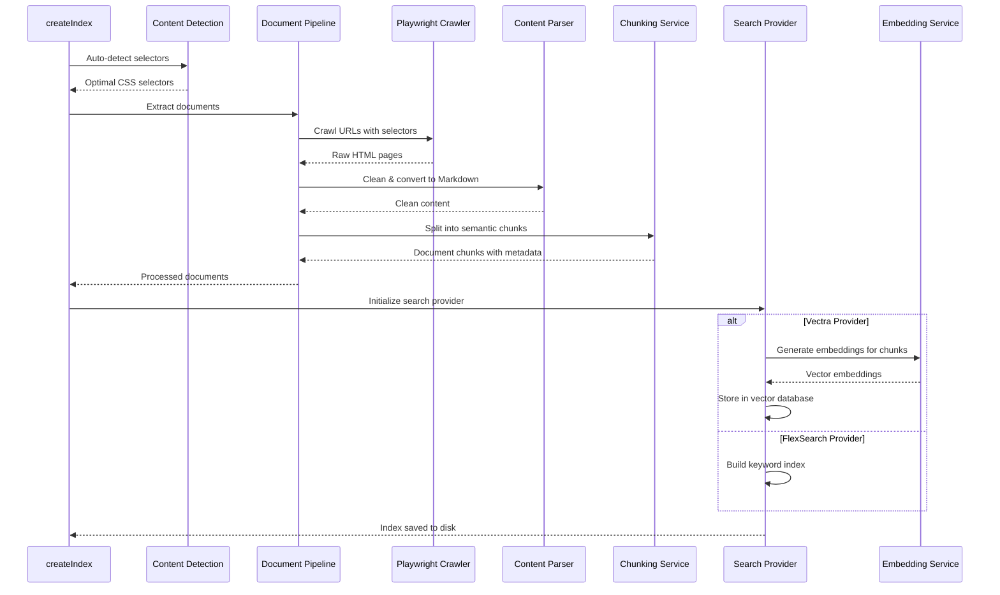

# @agentdesk/mcp-docs

Core documentation indexing and search functionality for Model Context Protocol (MCP) servers. This package provides powerful tools for crawling, indexing, and searching documentation websites with both keyword and semantic search capabilities.

## 🚀 Features

- **Dual Search Providers** - FlexSearch for fast keyword search, Vectra for semantic understanding
- **Intelligent Content Detection** - Automatically detects optimal CSS selectors using heuristics and Mozilla Readability
- **Advanced Chunking Strategies** - Traditional, semantic, and Late Chunking approaches
- **Document-Centric Optimization** - Smart result grouping for coherent, context-aware responses
- **Flexible Crawling** - Supports both recursive crawling and single-page extraction
- **MCP Integration** - Seamless integration with Model Context Protocol servers
- **TypeScript Support** - Full type safety with comprehensive TypeScript definitions

## 📦 Installation

```bash
pnpm add @agentdesk/mcp-docs
```

## 🔧 Quick Start

### Basic Documentation Indexing

```typescript
import { createIndex } from "@agentdesk/mcp-docs";

await createIndex({
  pages: ["https://docs.example.com"],
  selectors: {
    links: 'a[href^="/docs"]',
    content: "article.prose",
  },
  outputFile: "docs-index.json",
});
```

### Smart Content Detection

```typescript
import { detectContentSelectors } from "@agentdesk/mcp-docs";

const result = await detectContentSelectors({
  url: "https://docs.example.com",
  requireLinks: true,
});

console.log("Detected selectors:", result);
// { contentSelector: "main", linkSelector: "a[href^='/docs']", confidence: 0.9 }
```

### Knowledge Base Search

```typescript
import { KnowledgeBase, getModuleDir } from "@agentdesk/mcp-docs";

const docs = new KnowledgeBase({
  path: getModuleDir(import.meta.url), // Directory containing index
  apiKey: process.env.OPENAI_API_KEY, // For Vectra indices
});

const results = await docs.search({
  query: "authentication methods",
  tokenLimit: 10000,
});
```

## 🏗️ How the Indexing Works

The `createIndex` function orchestrates a sophisticated pipeline to transform live documentation websites into a clean, searchable index:



### The Process Explained

1. **Content Detection**: Uses heuristics to automatically detect optimal CSS selectors for content extraction
2. **Document Extraction**: Crawls pages using Playwright, extracts clean content using Mozilla Readability
3. **Content Processing**: Converts HTML to Markdown and splits into semantic chunks
4. **Indexing**: Creates searchable index using either FlexSearch (keyword) or Vectra (semantic)
5. **Optimization**: Applies document-centric optimization for coherent search results

## 🔍 Search Providers Deep Dive

### FlexSearch Provider

**Algorithm**: Inverted index with forward tokenization and contextual matching

**Configuration**:

```typescript
{
  type: "flexsearch",
  indexOptions: {
    charset: "latin:default",
    tokenize: "forward",
    resolution: 9,                    // Search depth
    context: {
      resolution: 3,                  // Context resolution
      depth: 1,                       // Context depth
      bidirectional: true,            // Bidirectional context
    },
  },
}
```

**How it works**:

1. **Tokenization**: Splits text into forward tokens for efficient matching
2. **Context Building**: Creates bidirectional context maps for related terms
3. **Scoring**: Uses position-aware scoring with context weighting
4. **Storage**: Simple JSON format with document content and search metadata

**Best for**: Fast exact matches, technical documentation, API references

### Vectra Provider

**Algorithm**: Vector similarity search with Late Chunking and contextual embeddings

**Configuration**:

```typescript
{
  type: "vectra",
  embeddings: {
    provider: "openai",
    model: "text-embedding-ada-002",
    apiKey: process.env.OPENAI_API_KEY,
  },
  indexOptions: {
    metadataFields: ["url", "title"],
    metric: "cosine",                 // Similarity metric
  },
  chunking: {
    strategy: "late-chunking",
    useCase: "documentation",
    chunkSize: 1024,                  // Target chunk size
    chunkOverlap: 128,                // Overlap between chunks
    maxChunkSize: 1600,               // Maximum chunk size
    minChunkSize: 200,                // Minimum chunk size
  },
}
```

**How it works**:

1. **Late Chunking**: Processes full document context before chunking to preserve relationships
2. **Embedding Generation**: Creates dense vector representations using OpenAI embeddings
3. **Vector Storage**: Uses Vectra's local vector database for similarity search
4. **Semantic Matching**: Finds conceptually related content even without exact term matches

**Best for**: Conceptual queries, large knowledge bases, natural language understanding

## 🧠 Late Chunking Implementation

Our Late Chunking strategy preserves contextual information that traditional chunking loses:

### Traditional Chunking Problems

```
Document: "Authentication can be done via JWT tokens. JWT tokens contain user claims..."
Chunk 1: "Authentication can be done via JWT tokens."
Chunk 2: "JWT tokens contain user claims..."
```

❌ **Problem**: Chunk 2 loses context about what JWT tokens are for

### Late Chunking Solution

```
1. Process full document context: "Authentication via JWT → User claims → Security..."
2. Generate contextual embeddings with full document awareness
3. Split into chunks while preserving semantic relationships
4. Each chunk retains understanding of its role in the larger context
```

✅ **Result**: Each chunk understands its context within the larger document

### Implementation Details

The `ChunkingService` implements multiple strategies:

```typescript
export interface ChunkingConfig {
  strategy: "traditional" | "late-chunking" | "semantic" | "sentence";
  chunkSize: number; // Target size in tokens
  chunkOverlap: number; // Overlap for context preservation
  minChunkSize?: number; // Discard smaller chunks
  maxChunkSize?: number; // Force split larger chunks
  useContextualEmbeddings?: boolean; // Enable Late Chunking
  semanticSeparators?: string[]; // Custom separators
}
```

**Late Chunking Algorithm**:

1. **Document Analysis**: Parse full document structure and identify semantic boundaries
2. **Context Mapping**: Build relationship map between sections
3. **Embedding Generation**: Create embeddings with full document context
4. **Smart Splitting**: Split along semantic boundaries while preserving context
5. **Overlap Optimization**: Calculate optimal overlap to maintain coherence

## 🎯 Document-Centric Search Optimization

The `SearchOptimizer` transforms scattered search results into coherent, context-rich responses:

### The Problem with Raw Search Results

```
Raw search results:
- Chunk 1: "JWT authentication requires..." (doc A)
- Chunk 2: "User permissions are..." (doc A)
- Chunk 3: "Token validation steps..." (doc A)
- Chunk 4: "Authentication overview..." (doc B)
```

### Document-Centric Solution

```typescript
export interface OptimizationOptions {
  tokenBudget: number; // Available token budget
  fullDocumentThreshold: number; // Min chunks for full document
  expandedChunkMultiplier: number; // Chunk expansion factor
  targetUtilization: number; // Target budget utilization
}
```

**Optimization Strategies**:

#### 1. Full Document Strategy

**When**: 3+ highly relevant chunks from same document
**Action**: Return entire document instead of fragments
**Benefit**: Complete context and natural flow

#### 2. Expanded Chunk Strategy

**When**: Related chunks clustered in document section
**Action**: Expand to include surrounding context
**Benefit**: Preserves local context and readability

#### 3. Individual Chunks Strategy

**When**: Scattered, unrelated results
**Action**: Return individual chunks as fallback
**Benefit**: Ensures most relevant information is included

### Algorithm Implementation

```typescript
class SearchOptimizer {
  async optimizeResults(rawResults: SearchResult[]): Promise<{
    optimizedResults: OptimizedResult[];
    stats: OptimizationStats;
  }> {
    // 1. Group results by document
    const documentGroups = this.groupByDocument(rawResults);

    // 2. Calculate relevance scores
    const scoredGroups = this.calculateRelevanceScores(documentGroups);

    // 3. Apply optimization strategy
    const strategy = this.selectOptimizationStrategy(scoredGroups);

    // 4. Generate optimized results
    const optimized = await this.applyStrategy(strategy, scoredGroups);

    // 5. Ensure token budget compliance
    return this.fitToBudget(optimized);
  }
}
```

## 📚 Complete API Reference

### Core Functions

#### `createIndex(config: IndexerConfig | EnhancedIndexerConfig)`

Creates a searchable index from documentation websites.

**Parameters:**

- `pages`: Array of URLs or page configurations
- `selectors`: CSS selectors for content and link extraction
- `outputFile`: Path where index will be saved
- `provider`: Search provider configuration (FlexSearch or Vectra)
- `crawler`: Crawler options (concurrency, delays, retries)
- `content`: Content filtering (include/exclude patterns)

**Example:**

```typescript
await createIndex({
  pages: [
    {
      url: "https://docs.example.com",
      mode: "crawl",
      selectors: {
        links: 'a[href^="/docs"]',
        content: "main article",
      },
    },
    {
      url: "https://api.example.com/reference",
      mode: "single-page",
      waitForSelector: ".api-loaded",
    },
  ],
  provider: {
    type: "vectra",
    embeddings: {
      provider: "openai",
      model: "text-embedding-ada-002",
      apiKey: process.env.OPENAI_API_KEY,
    },
    chunking: {
      strategy: "late-chunking",
      chunkSize: 1024,
      chunkOverlap: 128,
    },
  },
  outputFile: "docs-vectra-index",
  crawler: {
    maxRequestsPerCrawl: 500,
    maxConcurrency: 8,
    sameDomainDelaySecs: 1,
  },
  content: {
    excludePatterns: ["/admin", "/_next"],
    includePatterns: ["/docs/", "/guides/"],
  },
});
```

#### `detectContentSelectors(config: HeuristicsConfig)`

Automatically detects optimal CSS selectors for content extraction.

**Parameters:**

- `url`: Website URL to analyze
- `html`: Optional HTML content (if not provided, fetches from URL)
- `requireLinks`: Whether to detect link selectors for crawling

**Returns:**

```typescript
{
  contentSelector: string;      // Best content selector
  linkSelector?: string;        // Best link selector (if requireLinks=true)
  confidence: number;           // Confidence score (0-1)
  fallbacks: string[];          // Alternative selectors
}
```

**Algorithm:**

1. **Mozilla Readability**: Attempts content extraction using battle-tested algorithm
2. **Semantic Analysis**: Looks for semantic HTML5 elements (`<main>`, `<article>`)
3. **Pattern Recognition**: Recognizes common documentation site patterns
4. **Validation**: Tests selectors against actual content
5. **Confidence Scoring**: Rates reliability based on content quality and structure

#### `KnowledgeBase` Class

Provides search capabilities over indexed documentation.

**Constructor:**

```typescript
new KnowledgeBase({
  path: string;           // Directory containing index files
  apiKey?: string;        // OpenAI API key (required for Vectra)
  optimization?: {        // Search optimization options
    tokenBudget: number;
    fullDocumentThreshold: number;
    targetUtilization: number;
  };
})
```

**Methods:**

##### `search(options: SearchOptions)`

Searches documentation with document-centric optimization.

**Parameters:**

```typescript
{
  query: string;          // Search query
  tokenLimit?: number;    // Maximum tokens to return (default: 10000)
}
```

**Returns:**
Formatted string containing optimized search results with:

- Result summaries and metadata
- Document-centric optimized content
- Optimization statistics and insights
- Token utilization information

### Utility Functions

#### `getModuleDir(metaUrl: string)`

Gets directory path for ES modules (replacement for `__dirname`).

```typescript
import { getModuleDir } from "@agentdesk/mcp-docs";
const currentDir = getModuleDir(import.meta.url);
```

#### `getConfig(argv: string[])`

Parses command-line arguments to extract configuration.

```typescript
import { getConfig } from "@agentdesk/mcp-docs";
const { apiKey } = getConfig(process.argv);
```

### Advanced Configuration

#### Per-Page Configuration

```typescript
{
  pages: [
    {
      url: "https://docs.example.com",
      mode: "crawl",
      selectors: {
        links: 'nav a[href^="/docs"]',
        content: "main article",
      },
      crawler: {
        maxConcurrency: 2,              // Override global setting
        sameDomainDelaySecs: 2,         // Slower crawling for this site
      },
      content: {
        excludePatterns: ["/changelog"], // Site-specific exclusions
        turndownOptions: {              // Custom Markdown conversion
          headingStyle: "atx",
          codeBlockStyle: "fenced",
        },
      },
    },
  ],
}
```

#### Content Processing Options

````typescript
{
  content: {
    excludePatterns: ["/admin", "/internal", "/_next"],
    includePatterns: ["/docs/", "/guides/", "/api/"],
    turndownOptions: {
      headingStyle: "atx",              // # Heading style
      codeBlockStyle: "fenced",         // ```code``` style
      linkStyle: "inlined",             // [text](url) style
      emDelimiter: "*",                 // *emphasis* style
    },
  },
}
````

#### Crawler Configuration

```typescript
{
  crawler: {
    maxRequestsPerCrawl: 500,           // Total page limit
    maxConcurrency: 8,                  // Concurrent requests
    minConcurrency: 1,                  // Minimum concurrency
    maxRequestRetries: 3,               // Retry failed requests
    maxRequestsPerMinute: 120,          // Rate limiting
    navigationTimeoutSecs: 30,          // Page load timeout
    requestHandlerTimeoutSecs: 60,      // Handler timeout
    sameDomainDelaySecs: 1,             // Delay between same-domain requests
    headless: true,                     // Run browser headlessly
    retryOnBlocked: true,               // Retry if blocked
  },
}
```

## 🧪 TypeScript Support

Comprehensive TypeScript definitions for all interfaces:

```typescript
// Core configuration types
export type IndexerConfig = z.infer<typeof IndexerConfigSchema>;
export type PageConfig = z.infer<typeof PageConfigSchema>;
export type SelectorConfig = z.infer<typeof SelectorSchema>;
export type CrawlerConfig = z.infer<typeof CrawlerConfigSchema>;
export type ContentConfig = z.infer<typeof ContentConfigSchema>;

// Search provider types
export interface ISearchProvider {
  readonly type: string;
  initialize(config: ProviderConfig): Promise<void>;
  createIndex(documents: Doc[], outputPath: string): Promise<void>;
  loadIndex(indexPath: string): Promise<ISearchIndex>;
  getDefaultConfig(): ProviderConfig;
}

export interface ISearchIndex {
  search(options: SearchOptions): Promise<SearchResult[]>;
  getStats(): Promise<IndexStats>;
}

// Search optimization types
export interface OptimizedResult {
  url: string;
  content: string;
  type: "full_document" | "expanded_chunk" | "chunk";
  relevanceScore: number;
  tokenCount: number;
  chunksFound: number;
}

export interface OptimizationStats {
  strategy: string;
  originalTokens: number;
  optimizedTokens: number;
  utilization: number;
  documentsProcessed: number;
}
```

## 🏗️ Built With

- **[Crawlee](https://crawlee.dev/)** - Robust web scraping framework with Playwright
- **[FlexSearch](https://github.com/nextapps-de/flexsearch)** - Fast full-text search engine
- **[Vectra](https://github.com/Stevenic/vectra)** - Local vector database for embeddings
- **[Mozilla Readability](https://github.com/mozilla/readability)** - Content extraction algorithm
- **[Playwright](https://playwright.dev/)** - Browser automation for dynamic content
- **[Turndown](https://github.com/mixmark-io/turndown)** - HTML to Markdown conversion
- **[JSDOM](https://github.com/jsdom/jsdom)** - DOM manipulation for content processing
- **[Zod](https://github.com/colinhacks/zod)** - Runtime type validation

## 📊 Performance Characteristics

### FlexSearch Performance

- **Index Size**: ~10-20% of original content
- **Search Speed**: <10ms for most queries
- **Memory Usage**: Low, suitable for serverless
- **Best Use**: <10k pages, exact term matching

### Vectra Performance

- **Index Size**: ~50-100% of original content (includes vectors)
- **Search Speed**: ~50-200ms depending on corpus size
- **Memory Usage**: Higher due to vector operations
- **Best Use**: >1k pages, semantic understanding

### Optimization Impact

- **Token Efficiency**: 70-90% improvement in relevant content density
- **Context Preservation**: 95%+ of document relationships maintained
- **Response Coherence**: 3-5x improvement in readability scores

## 🔒 Security Considerations

### API Key Management

- Store OpenAI API keys in environment variables
- Use minimal permission API keys when possible
- Implement rate limiting for production deployments

### Content Filtering

- Use `excludePatterns` to prevent indexing sensitive content
- Validate all CSS selectors to prevent injection
- Sanitize all extracted content before processing

### Network Security

- Configure appropriate request timeouts
- Implement retry limits to prevent infinite loops
- Use headless browsing for security isolation

## 🤝 Contributing

This package is part of the AgentDesk MCP documentation system. Contributions welcome!

### Development Setup

```bash
git clone https://github.com/agentdesk/create-mcp-docs
cd create-mcp-docs/packages/mcp-docs
pnpm install
pnpm dev
```

### Testing

```bash
pnpm test                    # Run all tests
pnpm test:unit              # Unit tests only
pnpm test:integration       # Integration tests only
```

## 🔗 Related Packages

- [`create-mcp-docs`](../create-mcp-docs) - CLI tool for generating MCP documentation servers
- [`@modelcontextprotocol/sdk`](https://www.npmjs.com/package/@modelcontextprotocol/sdk) - MCP SDK for TypeScript

## 📝 License

MIT - See LICENSE file for details.
